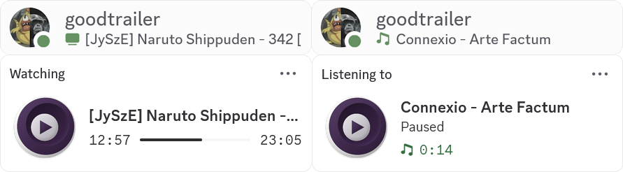

# mpv-rich-presence

[](https://github.com/goodtrailer/mpv-rich-presence/releases/latest)
[](https://www.codefactor.io/repository/github/goodtrailer/mpv-rich-presence/overview/main)
[](https://github.com/goodtrailer/mpv-rich-presence/blob/master/LICENSE)
[](https://somsubhra.github.io/github-release-stats/?username=goodtrailer&repository=mpv-rich-presence&page=1&per_page=0)


Windows/Linux mpv plugin for Discord Rich Presence (that doesn't suck), using the Discord Social SDK. Yes, the Discord Social SDK is a bit overkill, but the legacy [discord-rpc](https://github.com/discord/discord-rpc) library doesn't seem to support overriding the application name, which is used here to display the current media being played.

<p align="center"></p>

## Installation

Simply merge the contents of the distribution into your mpv config folder (e.g. `%APPDATA%/mpv` on Windows). Of course, the licenses/notices can (should) be omitted. Configure the plugin using the available options (see [§Configuration](#configuration)). By default, Rich Presence is initially off, so a `script-message-to rich_presence toggle` must be sent through the mpv console to toggle on Rich Presence.

## Configuration

### Options (`script-opts/rich-presence.conf`)
* `application_id=<id>` - the ID of the Discord application from the [Discord developer portal](https://discord.com/developers/applications)
* `on=<yes/no>` - initial setting of Rich Presence on/off

### Commands (`script-message-to rich_presence [cmd] [args]`)
* `toggle` - toggle Rich Presence on/off
* `on` - set Rich Presence on
* `off` - set Rich Presence off
* `application_id <id>` - set the ID of the Discord application from the [Discord developer portal](https://discord.com/developers/applications)

> [!TIP]
> I recommend adding in `input.conf` a binding like `D script-message-to rich_presence toggle` to easily toggle Rich Presence. Then, leave `on=no` in `rich-presence.conf`. This is so that Rich Presence is opt-in, and not everything you watch will be immediately shared.

## Building
### Setup

First, clone the repository *including submodules*:
```bash
git clone --recursive https://github.com/goodtrailer/mpv-rich-presence
```

Download the [Discord Social SDK](https://discord.com/developers/social-sdk). Unpack its contents into `thirdparty/discord_social_sdk`, such that `bin` is placed as `thirdparty/discord_social_sdk/bin`. Afterwards, set up vcpkg with one of the following (depending on your platform):
```batch
.\thirdparty\vcpkg\bootstrap-vcpkg.bat
```
```bash
./thirdparty/vcpkg/bootstrap-vcpkg.sh
```
Finally, configure the CMake project:
```bash
cmake --preset default
```
> [!TIP]
> You probably want to set the CMake variable `VCPKG_TARGET_TRIPLET` to the *static* version of your platform's triplet. Otherwise, the build may depend on Boost's shared libraries, which is less convenient for installation as an mpv plugin. On Linux, the default triplet `x64-linux` works as suggested. On Windows, use the `x64-windows-static-md` triplet, e.g.
> ```bash
> cmake -D VCPKG_TARGET_TRIPLET:STRING=x64-windows-static-md build
> ```

### Compilation/Packaging
Once the setup is complete, the following commands will build/install the project:
```
cmake --build build
cmake --build build --target install
```
If everything worked correctly, the complete binary distribution should be located in `install/mpv-rich-presence`.
